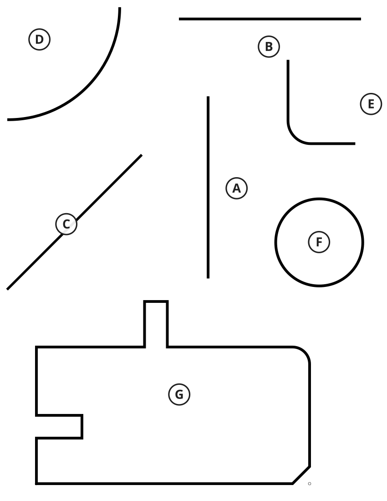

# FabScan Project History and Architectural Rationale

FabScan is an experimental LinuxCNC camera digitizer for tracing physical profiles and turning them into geometry that can be exported to DXF and cleaned up in CAM software such as SheetCam.

This document is not a changelog. `CHANGELOG.md` records what changed between versions.

`HISTORY.md` explains **why FabScan is built the way it is now**.

That distinction matters because many of the current design choices came from real failures on a physical plasma table. A future contributor looking only at the current code could reasonably ask why FabScan has a world-space path belief, a recorder/replay system, an SVG simulator, a separate planner and controller, or strict rules against allowing raw detector results to command motion directly.

The short answer is: we tried simpler approaches first, learned where they broke down, and changed the architecture accordingly.

---

## 1. The original idea

FabScan began with a simple goal:

1. Put a camera over a physical profile.
2. Detect the edge or line near the camera crosshair.
3. Move the LinuxCNC machine a small amount along that profile.
4. Repeat.
5. Save the traced path and export it to DXF.

For straight lines and gentle curves, this worked surprisingly well.

The first versions were intentionally simple. Plasma cutting does not require metrology-grade geometry, and SheetCam can clean up small line segments, fit arcs, recognize circles, link endpoints, and reduce detail after import.

That meant FabScan did not need to solve every geometry problem perfectly. It needed to produce a **stable, reasonably accurate trace**.

The difficult part turned out not to be DXF export.

It was deciding **where the machine should move next** when the camera sees corners, radii, nearby geometry, image noise, and imperfect line fits.

---

## 2. Early follower: local perception and bounded moves

The early follower operated mostly from the current camera frame.

A typical cycle looked roughly like:

```text
camera frame
    ↓
detect local profile
    ↓
estimate direction
    ↓
calculate a small correction
    ↓
make a bounded X/Y move
    ↓
repeat
```

This approach had several strengths:

- easy to understand
- easy to constrain for safety
- good on straight lines
- usable on broad curves
- small errors did not immediately become large machine moves

But it had an important limitation:

> A local detector can describe what it sees now, but it has very little memory of the path it has already followed or what the connected path is likely to do next.

That became most obvious at corners.

---

## 3. Corner Assist and the limits of reactive special cases

A large amount of development went into a feature called **Corner Assist**.

The basic idea was reasonable: detect two line segments, calculate their intersection, recognize that a sharp corner is approaching, and help the machine reach the corner rather than rounding it.

Several versions improved the details:

- corner look-ahead
- one-shot/re-arm behavior
- delayed engagement
- bounded assist moves
- pending corner targets
- stale-target checks
- corner-distance checks

This work improved some cases, but the architecture became increasingly reactive.

The deeper problem was not one bad threshold.

It was that a local detector result was being given too much authority.

A detected intersection could become a special machine target even though the detection had only limited context about:

- whether that intersection really belonged to the path being followed
- whether the feature was a sharp corner or part of a radius
- whether the geometry remained connected beyond the camera's local line fits
- whether the apparent corner was stable across multiple observations
- whether the machine had already established a different path direction

The important lesson was:

> **A detector result is evidence, not a motion command.**

That became one of the central design principles for the next architecture.

---

## 4. The architectural reset

After repeated Corner Assist regressions, development stopped and the problem was restated from scratch.

The new model became:

```text
Perception
    ↓
State estimator / world-space belief
    ↓
Predictor
    ↓
Planner
    ↓
Controller
    ↓
Motion
```

Or, in one sentence:

> **Detectors observe. The model remembers. The planner decides. Motion executes.**

This is the core idea behind FabScan v0.6.

The goal is not to make perception perfect.

The goal is to make perception one source of evidence inside a system that also understands recent path history, established travel direction, connected geometry, curvature, confidence, and machine constraints.

---

## 5. World-space path belief

The next major step was a persistent **world-space path belief**.

Instead of treating each camera frame as a fresh problem, FabScan maintains an estimate of the path state over time.

The belief can include information such as:

- estimated profile position
- current tangent
- filtered curvature
- curvature trend
- implied radius
- innovation from previous predictions
- usable connected look-ahead
- confidence
- predicted continuation

The important conceptual change is:

```text
previous belief + new evidence → revised belief
```

rather than:

```text
new camera frame → throw away old state → start over
```

A Kalman-style estimator may eventually be useful here, but the architecture does not require a specific filter. The important part is that FabScan now has an explicit state-estimation layer where better estimation techniques can be tested without redesigning the planner.

---

## 6. Multi-scale perception

Another lesson from physical tracing is that the best data for **precise local position** is not always the best data for **forward path understanding**.

FabScan therefore treats perception as two related scales:

### Near-field perception

Used for:

- precise profile location
- local cross-track error
- current tangent
- close correction

### Broader connected-path perception

Used for:

- forward continuation
- upcoming direction changes
- usable look-ahead
- candidate path selection
- trajectory planning

These are not two independent planners.

Both contribute to one world-space belief and one planner.

This helps avoid a common failure mode where a nearby disconnected line or local image feature can pull the machine away from the profile it has already established.

---

## 7. Why record/replay was added

Physical testing is valuable, but it is slow and difficult to reproduce exactly.

A planner change could fail differently simply because:

- the camera was at a slightly different position
- lighting changed
- the machine followed a slightly different path
- a different image frame was captured
- timing changed

FabScan therefore gained a **Follow Run Recorder**.

A recording stores the real data used during a run, including raw camera frames, settings, calibration, planner events, motion steps, and timeline data.

That made it possible to replay real camera evidence repeatedly without moving the machine.

A deterministic rerun system then verified that the same saved frames could reproduce the original decisions very closely.

This was a major improvement in debugging.

But it exposed another limitation.

---

## 8. The replay limitation

A recording contains camera frames only from the path the **old planner actually traveled**.

That means replay is excellent for:

- perception development
- estimator development
- regression testing
- reproducing a recorded failure

But it cannot fully validate a new planner once that planner chooses a different path.

Example:

```text
Old planner travels here
        ↓
recorded camera frames exist here

New planner would travel over there
        ↓
no recorded camera frames exist there
```

Once the paths diverge, the replay no longer knows what the camera would have seen.

That limitation led directly to the simulator.

---

## 9. Why the SVG simulator exists

The test sheet used for FabScan development was available as an exact SVG.

That gave the project something replay could never provide:

> **Ground truth and a virtual camera that can move wherever the new planner chooses.**

The simulator renders the SVG from the current virtual machine position, feeds that image into the real FabScan perception code, lets the estimator and planner decide where to move, moves the virtual machine, and repeats.

Conceptually:

```text
exact SVG geometry
       ↓
virtual camera at arbitrary X/Y
       ↓
real FabScan perception
       ↓
world-space belief
       ↓
connected-path planner
       ↓
virtual machine motion
       ↓
new camera position
       ↓
repeat
```

The simulator is not intended to replace physical testing.

Its purpose is to make planner development deterministic and to help separate problems into layers:

- perception
- estimation
- prediction
- planning
- controller behavior
- machine behavior


### A-G development test geometry

FabScan's repeatable development set uses seven known shapes from the same SVG sheet:



- **A** — vertical straight line
- **B** — horizontal straight line
- **C** — 45° straight line
- **D** — large 90° arc, approximately 2.5" radius
- **E** — small 90° radius, approximately 0.5", with tangent straight sections
- **F** — 2" diameter circle
- **G** — mixed geometry containing straight sections, an inside tab, an outside tab, a 45° corner, a radius corner, and sharp transitions

A-C provide basic straight-line and orientation checks. D-F exercise curvature and tangent continuity. G is intentionally the hardest mixed-geometry case and became the main end-to-end planner test.

The labels in the figure are documentation overlays. The underlying geometry is the same exact `TestImage.svg` used by the simulator.


---

## 10. Adding realism without inventing physics

The simulator initially used perfect SVG imagery.

That was useful for planner development, but too clean compared with the physical camera.

Real A-G recordings were therefore analyzed and used to create a measured camera appearance model.

Additional simulator layers were added gradually:

```text
exact SVG geometry
    ↓
measured camera appearance
    ↓
measured observation delay
    ↓
actual LinuxCNC velocity / acceleration limits
```

The current model includes real values from the FabLabPlasma machine configuration, including:

- 60 in/s² X/Y joint acceleration/deceleration
- 700 IPM joint velocity limit
- 4 ms LinuxCNC servo period
- approximately 120 ms observation-position delay used during development testing

A deliberate decision was made **not** to keep adding hypothetical realism simply because it was possible.

Effects such as:

- vibration
- backlash
- machine flex
- resonance
- motion blur
- structural oscillation

can be added later if they are measured or if a physical failure suggests they matter.

Until then, inventing values would turn the simulator from a machine model into an arbitrary stress generator.

Synthetic stress testing may still be useful, but it should be identified as synthetic rather than presented as measured realism.

---

## 11. Connected-path planning

The major planner change in v0.6 is that FabScan tries to follow the **connected continuation of the profile** rather than reacting only to local fitted lines.

The planner considers:

- current world-space belief
- established travel direction
- connected path ahead
- usable look-ahead
- curvature
- upcoming turn
- candidate clarity
- confidence
- safety constraints

The planner can recommend both:

- a bounded next trajectory
- a future velocity recommendation

For now, the physical machine still uses bounded step-and-settle execution.

Velocity recommendations are logged for future continuous-motion development.

The intended long-term direction is velocity-jog style following, but bounded moves provide a much safer development harness while the planner is still evolving.

---

## 12. Real-world return: what the machine taught us

After the connected-path planner became very reliable in simulation, it was returned to the physical table in deliberately conservative bounded-step mode.

The first real runs immediately exposed several useful differences between simulation and reality.

### 12.1 Start-direction confidence collapse

The first physical M6 test would make one good move and then HOLD because planner confidence collapsed.

The cause was not bad perception.

The estimator's first tangent was not seeded with the operator-selected Start direction.

A fitted line has two possible directions. The estimator could initialize 180° opposite the intended travel direction.

After the first real move established the actual direction, the estimator saw what looked like a sudden ~180° contradiction and heavily penalized confidence.

**Decision:**

Seed the estimator from the same Start direction used by the planner.

This restored stable startup confidence.

---

### 12.2 A correction-heavy move became "forward"

A later G test reached hundreds of steps before the no-reversal safety gate stopped it.

The previous physical move had contained a large cross-track correction. That sideways-heavy correction was then treated as the machine's new established travel direction.

The next legitimate forward move appeared to reverse away from it.

The safety rule was reasonable.

The definition of established travel was not.

**Decision:**

Separate:

- forward path progress
- lateral controller correction

and establish travel direction from a trailing path history rather than the immediately previous bump.

This became an important controller boundary.

---

### 12.3 Tiny image speck defeated a valid profile

Another real G run stopped with:

```text
no connected dark component near profile
```

The camera frame itself was good.

Near the planner seed there was a tiny dark scratch/speck. It was only slightly closer to the seed than the real profile.

The old association algorithm effectively did:

```text
find nearest dark pixel
    ↓
inspect that component
    ↓
component too small → reject
```

But it repeatedly rediscovered the same tiny invalid component and never considered the huge valid profile component immediately beside it.

**Decision:**

Choose the nearest **qualifying connected component**, not merely the component containing the nearest dark pixel.

When replayed against the physical recording, the corrected rule associated the profile successfully on every recorded frame, including the previous HOLD frame.

---

### 12.4 The machine really was making an X-then-Y "jerk"

While watching the table, the operator noticed that motion seemed to jerk when transitioning between X and Y.

At first it was reasonable to wonder whether this was only perception: the Y axis moves more machine mass than X.

The recording showed that the observation was real.

The planner was generating reasonably smooth XY vectors, but the legacy execution helper physically performed:

```text
move X
stop
move Y
stop
```

rather than one coordinated XY move.

**Decision:**

Execute each approved bounded planner vector as one coordinated LinuxCNC:

```text
G1 X... Y... F...
```

then wait for endpoint and interpreter IDLE before the next camera/planner cycle.

After this change, the visible X/Y jerk was greatly reduced.

This is a good example of why FabScan keeps planning and motion execution as separate layers.

The planner was not the source of the problem.

The executor was.

---

## 13. First strong physical v0.6 result

With the above corrections, a physical G trace completed all 800 requested steps without a HOLD.

The run stopped only because the configured step count was exhausted, leaving approximately 0.738" to return to the start.

The recorded path length plus the remaining distance closely matched the full simulated G path length, which indicated that motion had not been mysteriously lost.

The coordinated LinuxCNC executor also followed commanded endpoints very closely.

The physical trace was not as clean as the simulator, but it was substantially better than earlier real FabScan traces.

Most remaining error was concentrated around sharp geometric transitions rather than spread throughout the trace.

That distinction is important:

> The physical result no longer suggests that the overall architecture is unstable. It suggests that a small number of specific planner behaviors still need refinement.

---

## 14. Current sharp-corner question

The main known planner weakness entering the v0.6.0 alpha period is **sharp connected-path vertex handling**.

On several sharp G features, the physical planner begins turning slightly before reaching the true vertex.

The connected path already contains evidence for both the incoming and outgoing legs, so the current design question is not whether to revive the old Corner Assist mechanism.

It is how the connected-path planner should classify and commit to geometry.

The desired behavior is approximately:

```text
Is the connected continuation rotating smoothly?
        │
       yes
        ↓
Treat as radius / continuous curvature
Continue ordinary look-ahead planning


Is there strong evidence for two stable legs with a sharp transition?
        │
       yes
        ↓
Classify as a vertex
Commit to the vertex
Finish the incoming leg
Latch to the outgoing leg
Resume ordinary planning
```

The important word is **commit**.

A sharp vertex should not merely become a weak hint while the controller continues blending through it.

Likewise, a true radius should not be converted into a fake corner simply because two local line fits happen to intersect.

This is one of the most useful areas for outside review and experimentation.

---

## 15. Current architecture at a glance

```text
                   CAMERA
                      │
                      ▼
              ┌───────────────┐
              │  Perception   │
              │ near + broad  │
              └───────┬───────┘
                      │ evidence
                      ▼
              ┌───────────────┐
              │ World-space   │
              │ path belief   │
              └───────┬───────┘
                      │ state
                      ▼
              ┌───────────────┐
              │ Predictor /   │
              │ look-ahead    │
              └───────┬───────┘
                      │ candidates
                      ▼
              ┌───────────────┐
              │    Planner    │
              │ path progress │
              └───────┬───────┘
                      │ desired trajectory
                      ▼
              ┌───────────────┐
              │  Controller   │
              │ correction +  │
              │ safety limits │
              └───────┬───────┘
                      │ approved move
                      ▼
              ┌───────────────┐
              │   LinuxCNC    │
              │ coordinated   │
              │ bounded XY    │
              └───────┬───────┘
                      │
                      ▼
                   MACHINE
```

A parallel development toolchain supports that motion path:

```text
Real run recorder
      │
      ├──► deterministic replay
      │
      └──► failure analysis

Exact SVG test geometry
      │
      └──► virtual camera simulator
                 │
                 ├── measured camera appearance
                 ├── observation delay
                 ├── machine dynamics
                 └── exact ground truth
```

---

## 16. Decision tree: why the project is where it is

This is the condensed version of the development history.

```text
Can local camera following trace simple geometry?
        │
       yes
        ↓
Can it handle corners reliably?
        │
       no
        ↓
Add local corner detection / Corner Assist
        │
        ▼
Does adding more corner rules make behavior robust?
        │
       no
        ↓
Problem is architectural, not another threshold
        │
        ▼
Separate detector evidence from motion authority
        │
        ▼
Add persistent world-space state
        │
        ▼
Add connected-path look-ahead planner
        │
        ▼
Need repeatable testing without moving machine?
        │
       yes
        ↓
Add record/replay
        │
        ▼
Can replay test a planner after it diverges from old path?
        │
       no
        ↓
Add exact SVG ground-truth simulator
        │
        ▼
Perfect images too optimistic?
        │
       yes
        ↓
Measure real camera appearance and add it
        │
        ▼
Timing matters?
        │
       yes
        ↓
Add measured observation delay
        │
        ▼
Machine cannot instantaneously obey planner?
        │
       yes
        ↓
Add actual LinuxCNC motion limits
        │
        ▼
Simulator behaves well enough to justify physical test?
        │
       yes
        ↓
Return to real table with bounded steps and hard safety gates
        │
        ▼
Real table exposes startup direction bug
        │
        └──► seed estimator from Start direction
        │
        ▼
Real table exposes correction/travel-direction confusion
        │
        └──► separate progress from lateral correction
        │
        ▼
Real image exposes tiny-component association bug
        │
        └──► choose nearest qualifying component
        │
        ▼
Operator sees X/Y jerk
        │
        └──► logs show sequential X then Y execution
        │
        └──► change to coordinated XY motion
        │
        ▼
Physical G trace completes 800/800 steps
        │
        ▼
Remaining error concentrated at sharp vertices
        │
        ▼
CURRENT QUESTION:
How should connected-path geometry classify and commit
to sharp vertices without breaking radii?
```

---

## 17. Design principles contributors should know

These are not immutable rules, but they represent lessons learned the hard way.

### Detector outputs are observations

A raw line, intersection, contour, or Hough result should not directly command special machine motion.

### Preserve path history

A single noisy frame should not completely replace what several previous frames established.

### Connected geometry matters

The nearest dark feature is not necessarily the path being followed.

### Planner and controller are different problems

The planner decides where the path should go.

The controller decides how much forward progress and lateral correction can safely be applied.

The machine executor should not secretly change the geometry of the planner command.

### Prefer explicit HOLD over guessing

When FabScan cannot identify a safe continuation, stopping is better than silently choosing a branch.

### Safety gates should be independent

Important constraints such as maximum move length and reversal protection should not rely on the planner behaving perfectly.

### Simulate what can be justified

Measured effects belong in the realistic simulator.

Unmeasured effects should be clearly identified as synthetic stress tests.

### Physical testing remains authoritative

A simulator is a debugging bench, not proof that the real machine will behave identically.

---

## 18. Areas where open-source help would be especially valuable

FabScan is intentionally being released while still in alpha because outside review can improve the architecture before it hardens.

Useful areas include:

### Sharp vertex versus radius classification

This is currently the most obvious planner problem.

Questions include:

- How should a connected path decide that a feature is a true vertex?
- When should that classification become committed?
- How should the outgoing leg be latched?
- How much evidence should be required before changing classification?
- How should short fillets or imperfect printed corners be treated?

### State estimation

The current belief system works, but there is room to explore:

- Kalman filtering
- extended Kalman filtering
- robust estimators
- confidence models
- better innovation handling
- curvature-state estimation

Any replacement should be evaluated against real recordings and the simulator rather than only synthetic examples.

### Connected-path association

Potential improvements include:

- stronger temporal association
- branch scoring
- topology-aware continuation
- rejecting disconnected nearby geometry
- handling crossings and tabs
- better confidence measures

### Continuous motion

The long-term goal is not endless stop-and-step motion.

The planner already produces information that could support velocity-based control, including look-ahead, curvature, confidence, and recommended velocity.

A future controller may use LinuxCNC velocity jog or another continuous method, but that should happen only after the path planner is trustworthy enough that higher-speed mistakes are unlikely.

### Diagnostics

One goal of the project is for a failed trace to explain itself.

Useful future diagnostic work includes better automatic distinction between:

- perception failure
- association failure
- estimator failure
- planner decision failure
- controller limitation
- machine execution error

### Simulator validation

If a physical run reveals a repeatable effect not represented in simulation, the preferred approach is:

1. measure the effect if possible
2. add it to the simulator
3. reproduce the physical failure
4. test candidate fixes in simulation
5. return to the machine

This is more useful than adding random complexity to the simulator preemptively.

---

## 19. What FabScan v0.6.0-alpha.1 means

The alpha tag does **not** mean FabScan is finished.

It means the project has reached an important boundary:

- the old reactive corner-heavy approach has been replaced by a stateful connected-path architecture
- record/replay provides repeatable real-camera regression data
- the SVG simulator provides exact ground truth and alternate-path testing
- measured camera, delay, and machine effects are represented in simulation
- the new planner has successfully driven the physical LinuxCNC table through complex test geometry using conservative bounded coordinated moves
- safety HOLD behavior has prevented several real development faults from becoming uncontrolled motion
- the remaining problems look increasingly like identifiable planner refinements rather than a need for another complete architectural reset


### Simulation versus the first strong physical G trace

The alpha boundary is based on more than a successful-looking screen trace. The same difficult **G** geometry shown above was run both in the ground-truth simulator and on the physical FabLabPlasma machine.

The comparison is not perfectly apples-to-apples: the simulator completed a closed loop, while the physical M6.2 run stopped because its configured Count reached 800 with approximately 0.7385" of the final straight section remaining. That limitation is shown rather than hidden.

| Measurement | M5.6 ground-truth simulation | M6.2 physical FabLabPlasma run |
| --- | ---: | ---: |
| Result | Closed loop | 800/800 steps; Count-limited |
| Recorded travel | 21.5182" | 20.7706" |
| Remaining distance to start | Closed | 0.7385" |
| Implied full-loop length | 21.5182" | 21.5091" |
| Difference in implied loop length | — | 0.0091" |
| RMS cross-track error versus SVG | 0.00103" | 0.00446" |
| Maximum cross-track error versus SVG | 0.00398" | 0.0310" |

The physical result is therefore not as geometrically clean as the simulator, but the difference is highly structured rather than random.

For the physical M6.2 trace:

- approximately **87.6%** of the path was within 0.005" of the SVG centerline
- approximately **96.4%** was within 0.010"
- away from the troublesome sharp-transition regions, RMS cross-track error was approximately **0.00215"**
- LinuxCNC executed the coordinated XY endpoints very closely: average endpoint miss was approximately **0.00045"**, with a worst observed miss of approximately **0.00068"**

The largest physical errors occur around several sharp vertices where the connected-path planner begins turning slightly before reaching the true vertex. This matters architecturally: the remaining error does not look like general LinuxCNC motion error, random path loss, or broad planner instability. It is concentrated around a specific geometry-classification/commitment problem.

That result is one reason v0.6.0-alpha.1 is a useful point to invite outside review. The basic architecture is producing a trace close enough to ground truth that remaining weaknesses can increasingly be discussed as specific, measurable planner problems.

The most visible known issue at this point is therefore **premature turning at some sharp connected-path vertices**.

That is exactly the kind of problem an alpha release should expose to wider review.

---

## 20. The intended development loop going forward

FabScan development should continue to use all three environments:

```text
REAL RECORDINGS
    │
    ├── reproduce perception and estimator behavior
    └── capture failures exactly

SIMULATOR
    │
    ├── test alternate planner paths
    ├── compare against exact geometry
    └── experiment safely

PHYSICAL TABLE
    │
    ├── validate real behavior
    └── reveal effects the models missed
```

When a real failure does not make sense:

```text
record it
    ↓
identify which layer diverged
    ↓
reproduce it in replay or simulation if possible
    ↓
fix the responsible layer
    ↓
regression-test known geometry
    ↓
return to the real machine
```

The simulator can always be revisited.

It is not something that must be "finished" before physical testing, nor should physical testing prevent further simulator work.

The two should inform each other.

---

## 21. Final perspective

FabScan started as a small camera-following utility.

The project became more interesting when it encountered the same problem many autonomous systems encounter in miniature:

> Seeing something is not the same as understanding what it means, and understanding it is not the same as deciding how to move.

The current architecture reflects that distinction.

```text
Perception sees.
State remembers.
Prediction looks ahead.
Planning chooses.
Control constrains.
LinuxCNC moves.
Recording explains what happened.
Simulation lets us try again safely.
```

That is why FabScan is where it is today.

Contributions that make any of those layers simpler, more reliable, more measurable, or easier to understand are welcome.
